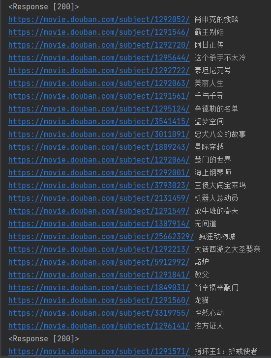

<!--
 * @Author: coco369
 * @Date: 2021-08-07 15:37
 * @Description: 快速上手抓取豆瓣电影TOP250电影信息
-->

# 豆瓣电影Top250抓取

豆瓣电影TOP250地址: https://movie.douban.com/top250

## 1. 抓取电影列表页面中的电影和电影地址信息

以下演示使用xpath来提取页面中的内容, 亦可使用beautifulSoup和css选择器进行页面内容的提取:

我们打开检查工具，选择需要提取的内容, 鼠标右键就可以直接Copy整个电影列表区域的xpath, 如下xpath表达式

    //*[@id="content"]/div/div[1]/ol/li

创建爬虫

    默认创建轻量级爬虫, 可以不指定爬虫类型:light
    
    fastspider startspider -s douban_spider [light]  

## 2. 开始写代码

1. 根据豆瓣电影TOP250的URL规律, 定义需要执行的任务

       start_urls = "https://movie.douban.com/top250?start="
    
       def start_requests(self):
           for i in range(0, 10):
               url = self.start_urls + str(int(i) * 25)
               yield fastspider.Request(url=url)

2. 回调parse回调方法, 解析电影的标题和链接

       def parser(self, request, response):
           print(response)
           movies = response.xpath('//*[@id="content"]/div/div[1]/ol/li')
           for movie in movies:
               href = movie.xpath('./div/div[2]/div[1]/a/@href')[0].get()
               title = movie.xpath('./div/div[2]/div[1]/a/span[1]/text()')[0].get()
    
               print(href, title)

3. 运行，打印如下：

   

## 3. 代码分析

豆瓣电影TOP250分为10页, 每一页25条电影信息, 首先需要组装每一页的地址url, 然后将url作为任务进行请求调度，并通过回调callback进行解析。写法很简单，代码如下：

派发详情任务：

    yield fastspider.Request(url, callback=self.parser)  # callback 为回调函数, 默认回调函数为parser

若我们需要携带title字段，写法如下

    yield fastspider.Request(url, callback=self.parser, meta={"title": title})  # 需要在回调中解析的自定义参数, 可以定义在meta里

解析详情

    def parser(self, request, response):
        print(response)
        movies = response.xpath('//*[@id="content"]/div/div[1]/ol/li')
        for movie in movies:
            href = movie.xpath('./div/div[2]/div[1]/a/@href')[0].get()
            title = movie.xpath('./div/div[2]/div[1]/a/span[1]/text()')[0].get()
    
            print(href, title)

## 整体代码如下

    # encoding=utf-8
       
    import fastspider

   

    class DouBanSpider(fastspider.LightSpider):
        start_urls = "https://movie.douban.com/top250?start="
       
        def start_requests(self):
            for i in range(0, 10):
                url = self.start_urls + str(int(i) * 25)
                yield fastspider.Request(url=url)
       
        def parser(self, request, response):
            print(response)
            movies = response.xpath('//*[@id="content"]/div/div[1]/ol/li')
            for movie in movies:
                href = movie.xpath('./div/div[2]/div[1]/a/@href')[0].get()
                title = movie.xpath('./div/div[2]/div[1]/a/span[1]/text()')[0].get()
       
                print(href, title)

   

    if __name__ == "__main__":
        DouBanSpider().start()

嫌弃跑的太慢? 我们可以加一个参数轻松解决

    if __name__ == "__main__":
        DouBanSpider(thread_count=5).start()

thread_count 为线程数

